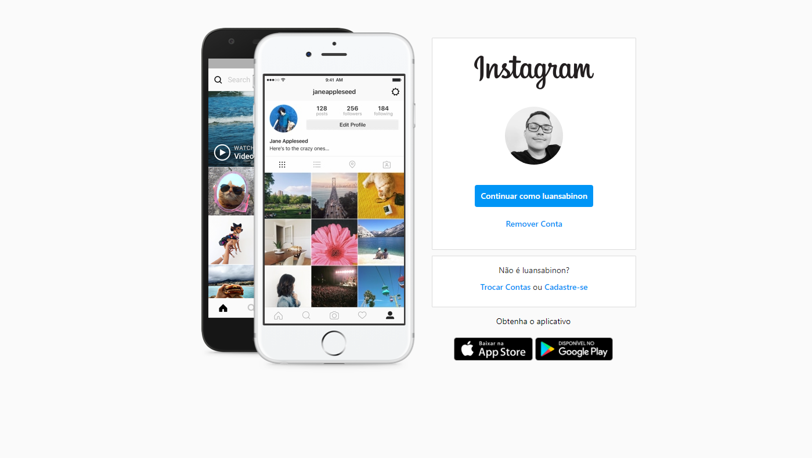
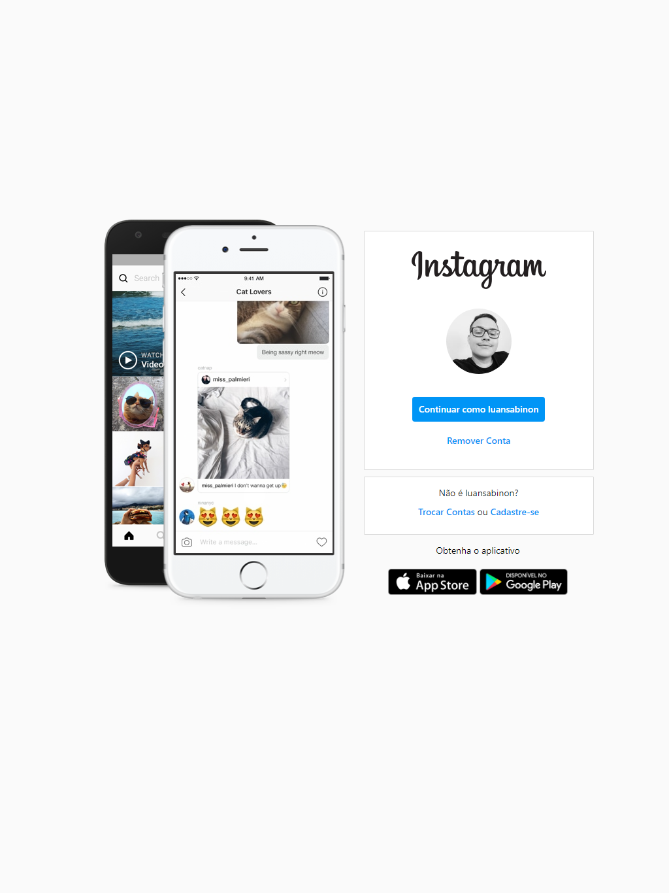
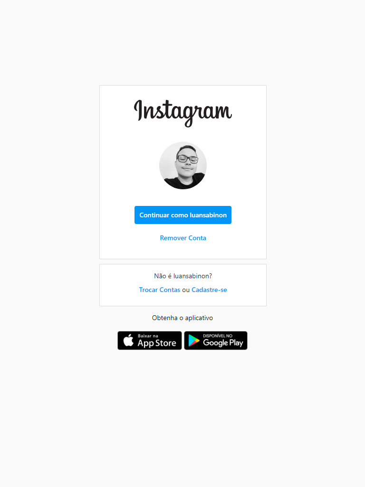
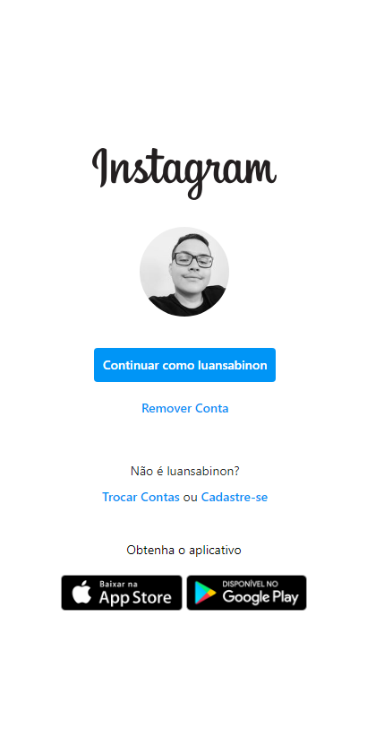

# Replica da Pagina de Login do Instagram 📷

## 💻

## 📱
<table>
  <tr>
    <td>Em um Ipad Pro</td>
     <td>Em um tablet</td>
     <td>Em um celular</td>
  </tr>
  <tr>
    <td valign="top"></td>
    <td valign="top"></td>
    <td valign="top"></td>
  </tr>
 </table>

Projeto apresentado durante um bootcamp da [Digital Innovation One](https://digitalinnovation.one)
A ideia do projeto é replicar uma das paginas de login do instagram para aprender conceitos sobre o uso de Flexbox, e responsividade.
A parte mais complicada desse projeto foi compreender como executar a animação de transição das imagens demonstrativas usando somente HTML/CSS
O codigo usado para efetuar essa animação começa na linha  do arquivo CSS.
